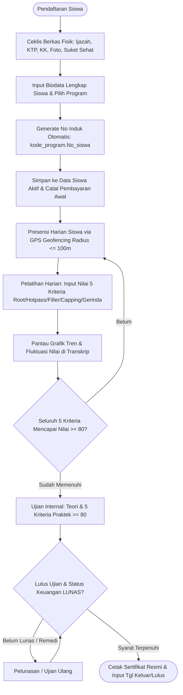

# Product Requirement Document (PRD) — Sistem LPKS Pengelasan

## Ringkasan & Target Pengguna
Sistem manajemen dan operasional berbasis web untuk Lembaga Pelatihan Kerja Swasta (LPKS) pengelasan "Sumbu Hidup" dengan model pelatihan berbasis individu (*continuous enrollment / per-anak* tanpa sistem angkatan). Sistem ini memiliki 2 role pengguna:
1. **Superadmin**: Akses penuh ke seluruh modul sistem (mengelola pendaftaran, verifikasi berkas, pencatatan pembayaran & keuangan, input nilai harian 5 kriteria, input nilai ujian internal, pengelolaan master data dinamis, pemanfaatan AI analytics/RAG, pengelolaan import/export Excel, serta persetujuan & cetak sertifikat).
2. **Siswa**: Portal mandiri untuk memantau progres belajar pribadi, melihat grafik metrik fluktuasi nilai 5 kriteria di transkrip, mengecek status tagihan/pembayaran, membaca ringkasan progres mingguan dari AI, dan mengunduh e-sertifikat jika telah lulus dan lunas.

Sistem juga berfungsi sebagai portfolio *showcase AI Engineer* dengan menghadirkan fitur Computer Vision dan RAG (Retrieval-Augmented Generation) di atas data terstruktur.

---

## Fitur Utama

### 1. Modul Pendaftaran (Student Enrollment & Physical Verification)
- Sistem HARUS mendukung pendaftaran siswa baru per-anak secara fleksibel kapan saja.
- **Verifikasi Berkas Fisik (Checklist Saja, Tanpa Fitur Upload):**
  - Superadmin mencentang checklist verifikasi fisik yang diserahkan calon siswa:
    - [ ] Fotokopi Ijazah terakhir (2 lembar)
    - [ ] Fotokopi KTP (2 lembar)
    - [ ] Fotokopi KK (2 lembar)
    - [ ] Pas foto 3x4 latar belakang merah (3 lembar)
    - [ ] Surat keterangan sehat dokter (1 lembar)
- **Form Input Data Siswa Lengkap (Terbuka setelah checklist terpenuhi):**
  - **Nomor Induk Otomatis:** `kode_program.No_siswa` (kode program otomatis sesuai pilihan kursus, `No_siswa` 4 digit otomatis *auto-increment* melanjutkan nomor terakhir, contoh: `01.0001`, `01.0002`).
  - **Pilihan Program Pelatihan:** 
    - SMAW 4G 5jt 30hari (kode 01)
    - SMAW 6G 7,5jt 51 hari (kode 01)
    - GTAW 6G 8,5jt 51 hari (kode 02)
    - GTAW + SMAW 6G 13jt 98 hari (kode 03)
    - FCAW + GMAW 3G 8jt 25hari (kode 04)
  - **Data Pribadi:** Nama Lengkap, NIK (16 digit), Tempat Lahir, Tanggal Lahir.
  - **Alamat Lengkap:** Jalan/Dusun/Daerah (termasuk No. Rumah), RT, RW, Kelurahan/Desa, Kecamatan, Kabupaten/Kota, Provinsi.
  - **Data Orang Tua:** Nama Ayah, Nama Ibu.
  - **Kontak & Riwayat Pendidikan:** No. HP/WhatsApp, Email, Pendidikan Terakhir, NISN.
  - **Tanggal Masuk:** Tanggal resmi mulai pelatihan.
- Setelah formulir disubmit, data langsung terdaftar ke database dan sistem **secara otomatis menerbitkan kredensial login** (Username berformat `nama@urutan`, contoh `budi@0005`, dan Password Default yang sama persis dengan username). Validasi duplikasi NIK dan username aktif untuk mencegah pembuatan akun ganda.

### 2. Modul Manajemen Data Siswa (Student Directory & Lifecycle)
- Sistem HARUS menyediakan manajemen direktori seluruh siswa (CRUD Data Siswa lengkap).
  - **Edit Data:** Sesuai prinsip integritas `Nomor Induk` (yang juga menjadi `Username`), pengubahan **Program Pelatihan** untuk siswa yang sudah terdaftar DILARANG (di-*disable* pada UI Edit).
  - **Penghapusan (Soft Delete & Anonimisasi):** Menghapus siswa akan memicu anonimisasi data pribadi (NIK, No. HP, Alamat) dan mengubah status siswa menjadi Keluar/Alumni (`Tanggal Keluar` terisi), namun data statistik akademik (nilai, presensi) dipertahankan sesuai UU PDP.
- Sistem HARUS memiliki kolom **Tanggal Keluar** untuk menandai status siswa:
  - **Siswa Aktif:** `Tanggal Keluar` masih kosong / `null`.
  - **Alumni / Selesai / Keluar:** `Tanggal Keluar` terisi (lengkap dengan tanggal kelulusan/selesai).
- Sistem HARUS menyediakan fitur **Filter & Pencarian Cepat** berdasarkan Status (Aktif/Alumni), Program Pelatihan, dan Nomor Induk/Nama.
- Sistem HARUS menyediakan fitur **Download Template Excel (.xlsx)** khusus format Data Siswa.
- Sistem HARUS menyediakan fitur **Import Excel (.xlsx)** untuk pendaftaran/migrasi data siswa secara massal.
- Sistem HARUS menyediakan fitur **Export Excel (.xlsx)** untuk seluruh direktori data siswa.

### 3. Modul Presensi & Absensi Siswa (GPS Geofencing)
- **Presensi Mandiri Siswa (1x Presensi Datang per Hari):** Siswa melakukan presensi kehadiran 1 kali sehari secara mandiri melalui smartphone saat tiba di bengkel pelatihan LPKS.
- **Validasi Geolocation & Radius (Geofencing 100m):**
  - Menggunakan API Geolocation bawaan browser (*HTML5 Geolocation*) tanpa biaya pihak ketiga.
  - Memverifikasi koordinat siswa terhadap titik lokasi LPKS Sumbu Hidup (*Latitude/Longitude* dan batas toleransi radius default 100 meter yang tersimpan di Master Data).
  - Presensi HANYA diizinkan jika siswa terdeteksi berada di dalam radius $\le 100$ meter dari lokasi LPKS. Jika di luar radius, presensi ditolak dengan pesan peringatan jarak aktual.
  - Mencegah duplikasi: Siswa hanya dapat melakukan presensi 1 kali per hari kalender.
- **Monitoring & Manajemen Presensi Superadmin:**
  - Superadmin dapat memantau log kehadiran harian seluruh siswa aktif (*timestamp presensi*, koordinat/jarak, status: Hadir/Izin/Sakit/Alpa).
  - Superadmin memiliki wewenang manual *override* / entri kehadiran jika siswa terkendala perangkat atau sedang izin resmi.
- **Integrasi Excel (Bulk I/O):**
  - Fitur **Download Template Excel (.xlsx)** untuk rekapan absensi.
  - Fitur **Import Excel (.xlsx)** untuk memasukkan riwayat absensi lampau / massal.
  - Fitur **Export Excel (.xlsx)** laporan presensi harian, mingguan, dan bulanan.

### 4. Modul Catatan Keuangan (Financial Tracking)
- Sistem HARUS mencatat transaksi pembayaran per siswa (No Induk, Nama, Program, Tanggal Bayar, Nominal, Metode).
- Sistem HARUS mengidentifikasi dan menampilkan status pembayaran siswa secara jelas (**Lunas** vs **Cicil / Belum Lunas** beserta sisa tagihan).
- Sistem HARUS memberikan penanda visual instan (badge/indikator) jika siswa sudah lunas.
- Sistem HARUS mendukung Import/Export rekapan keuangan dalam format Excel (.xlsx).

### 5. Modul Penilaian Harian (Daily Practical Assessment)
- Sistem HARUS memungkinkan Superadmin menginput nilai harian (skala 0 - 100) per siswa pada **5 kriteria pengelasan**:
  1. *Root*
  2. *Hotpass*
  3. *Filler*
  4. *Capping*
  5. *Gerinda*
- Sistem HARUS mendukung input fleksibel per hari (bisa 1 kriteria atau beberapa kriteria sekaligus sesuai aktivitas pengerjaan siswa pada hari tersebut).
- Sistem HARUS menyediakan visualisasi **grafik metrik (trend line/chart)** per kriteria pada transkrip/detail nilai siswa untuk melihat fluktuasi dan progres belajar harian (misal: naik/turun performa hari demi hari).
- Sistem HARUS menentukan kelayakan siswa menuju Ujian Internal bukan dari akumulasi poin, melainkan saat siswa mencapai standar kompetensi yaitu nilai di **seluruh 5 kriteria bernilai minimal 80** (>= 80).
- Sistem HARUS mendukung Import/Export rekapan nilai harian dalam format Excel (.xlsx).

### 6. Modul Ujian Internal & Sertifikasi
- Sistem HARUS menyediakan form penilaian Ujian Internal yang terdiri dari:
  - Nilai Ujian Tertulis (1 kolom nilai teori).
  - Nilai Ujian Praktek (**5 kolom**: *Root*, *Hotpass*, *Filler*, *Capping*, *Gerinda*), dengan standar kelulusan minimal nilai 80 di masing-masing kriteria.
- Sistem HARUS memvalidasi dua syarat mutlak sebelum membuka opsi cetak sertifikat:
  1. Siswa telah **LULUS** Ujian Internal (tertulis & praktek kelima kriteria >= 80).
  2. Status keuangan siswa sudah **LUNAS**.
- Sistem HARUS menyediakan fitur cetak / export sertifikat berformat PDF siap pakai berdasarkan template standar yang sudah ada.

### 7. Modul Pengaturan & Master Data Dinamis (System Configuration & Master Data)
- Sistem HARUS menyediakan manajemen Master Data dinamis yang dapat dikelola oleh Superadmin tanpa perlu mengubah source code:
  - **Master Titik Lokasi & Radius Presensi:** Pengaturan titik koordinat latitude/longitude LPKS dan toleransi radius (default: 100 meter).
  - **Master Program Pelatihan:** CRUD data program (Nama Program, Biaya/Harga Pelatihan, Estimasi Durasi Hari, Kode Program).
  - **Master Kriteria Penilaian:** Konfigurasi kriteria penilaian las serta pengaturan ambang batas minimal kelulusan (default: 80).
  - **Master Syarat Pendaftaran:** Fleksibilitas untuk menambah/mengubah daftar checklist berkas persyaratan fisik.

### 8. Modul AI Showcase (AI Engineer Integration)
- **Asisten Analitik Operasional & Konsultan SOP Las (RAG):** Sistem HARUS menyediakan chatbot internal yang menggunakan kapabilitas *Dual-Model* (Gemini 2.5 Flash & Claude 3.7 Sonnet) untuk menjawab pertanyaan operasional, rekap nilai siswa, maupun *Welding SOP / Best Practices* berdasarkan referensi pengelasan.
- **Ringkasan Progres Otomatis (Weekly Narrative Summary):** Sistem HARUS dapat meng-generate ringkasan naratif perkembangan belajar & kedisiplinan setiap siswa secara otomatis per minggu dalam bahasa natural yang siap diekspor/dikirim ke orang tua atau perusahaan sponsor.

---

## Batasan Penting (Non-Fungsional Ringkas)
- **Modal Rp 0 (Free Hosting & Free Tier):** Seluruh arsitektur backend, database, frontend, dan AI API harus memanfaatkan free-tier (seperti Vercel/Render, Supabase/Neon PostgreSQL, dan Gemini Flash/Pro API). Presensi GPS memanfaatkan Browser Native Geolocation API tanpa vendor berbayar.
- **Kapasitas Pengguna:** Sistem dioptimasi untuk beban ~50 pengguna aktif harian tanpa latensi berlebih.
- **Responsif & Mobile Friendly:** Antarmuka responsif dan ramah perangkat seluler / tablet untuk input presensi siswa dan penilaian praktis di area bengkel las.
- **Simplicity First (Ponytail Ladder):** Mengutamakan struktur kode yang bersih, minim dependensi berlebih, dan efisien dalam konsumsi token API AI.

---

## Alur Pengguna Utama (End-to-End User Flow)

---

## Acceptance Criteria Ringkas
1. Modul pendaftaran memvalidasi checklist berkas fisik dan menghasilkan No Induk berformat `kode_program.No_siswa` secara otomatis (auto-increment).
2. Modul Data Siswa mengelola biodata lengkap, mendukung status Aktif vs Alumni via `Tanggal Keluar`, serta mendukung Import, Export, dan Download Template Excel (.xlsx).
3. Modul Presensi GPS memverifikasi kehadiran siswa secara akurat dalam radius $\le 100$ meter dari koordinat LPKS dan mendukung rekap/import/export Excel.
4. Superadmin dapat mencatat nilai harian 5 kriteria pengelasan (skala 0-100) dan memantau grafik tren performa siswa di transkrip nilai.
5. Kelayakan ujian internal terbuka otomatis saat 5 kriteria harian mencapai >= 80.
6. Sertifikat terkunci secara sistem dan HANYA bisa dicetak saat siswa Lulus Ujian Internal (teori & 5 kriteria praktek >= 80) DAN Keuangan berstatus Lunas.
7. Asisten RAG dapat menjawab query analitik data siswa/absensi/nilai/keuangan secara akurat, dan Ringkasan Progres Mingguan dapat di-generate dalam 1 klik.
8. Master data (lokasi presensi & radius, harga program, durasi, kriteria penilaian, syarat berkas) dapat dikelola secara dinamis langsung dari antarmuka aplikasi.

---

## Out of Scope (Untuk Rilis Awal / MVP)
- Integrasi Payment Gateway otomatis (menggunakan pencatatan manual/upload bukti transfer untuk menjaga modal Rp 0).
- Presensi berbasis pemindai wajah (Face Recognition AI / Biometrik kompleks) — presensi mengandalkan GPS Geofencing browser bawaan demi performa ringan dan modal Rp 0.
- Multi-cabang LPK (fokus pada 1 cabang LPKS Sumbu Hidup).
