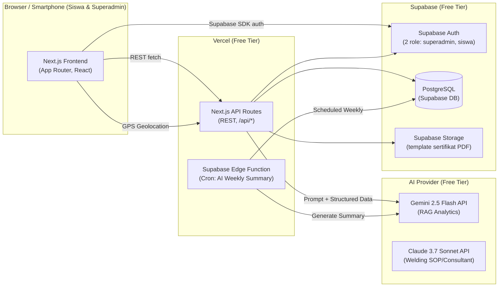
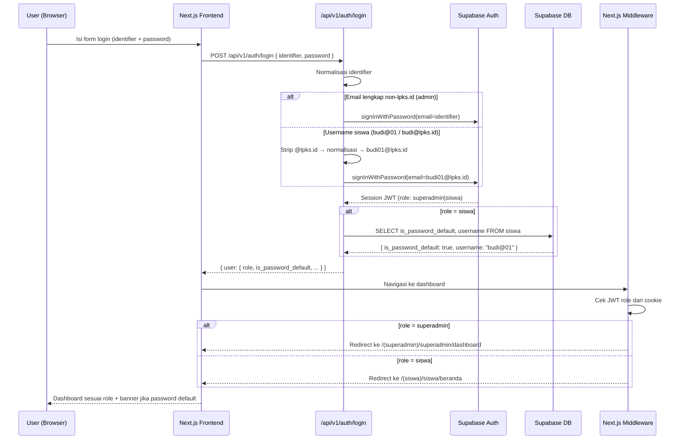
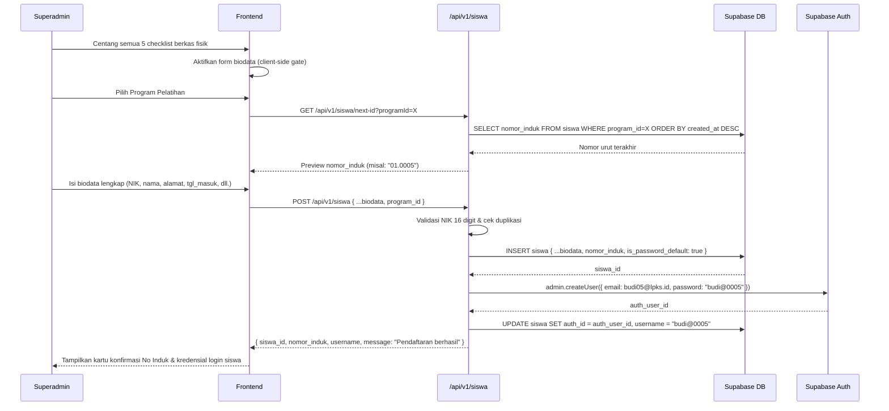
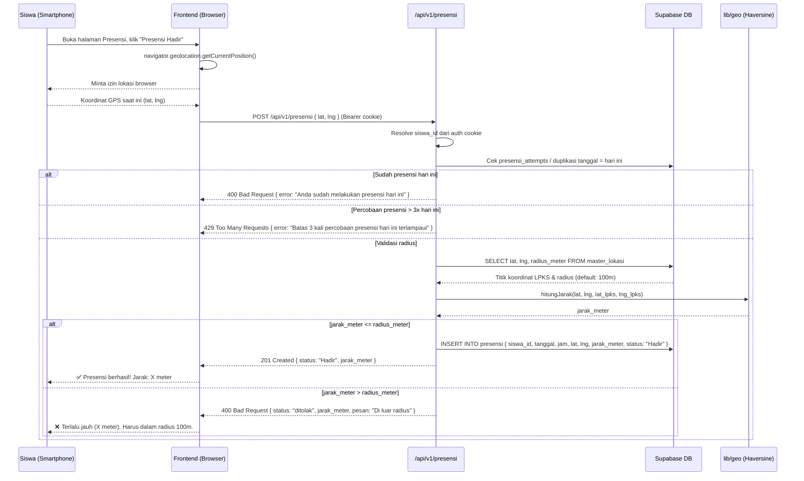
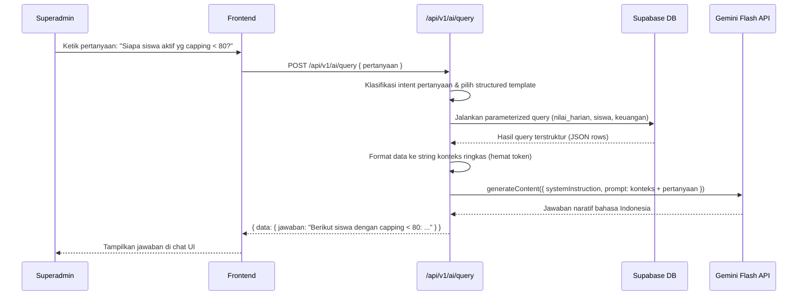
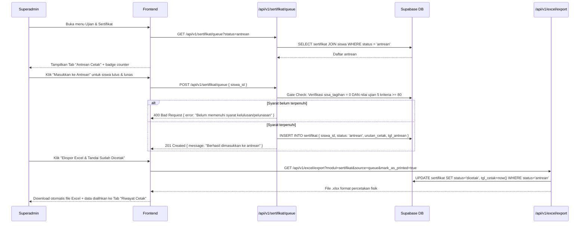
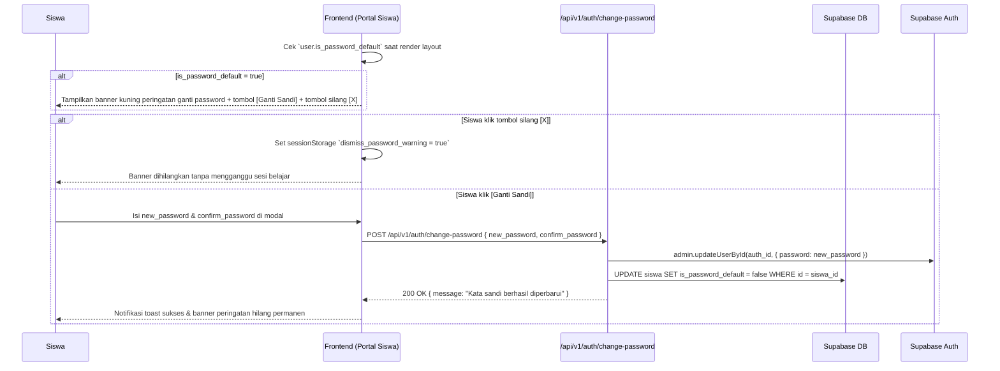
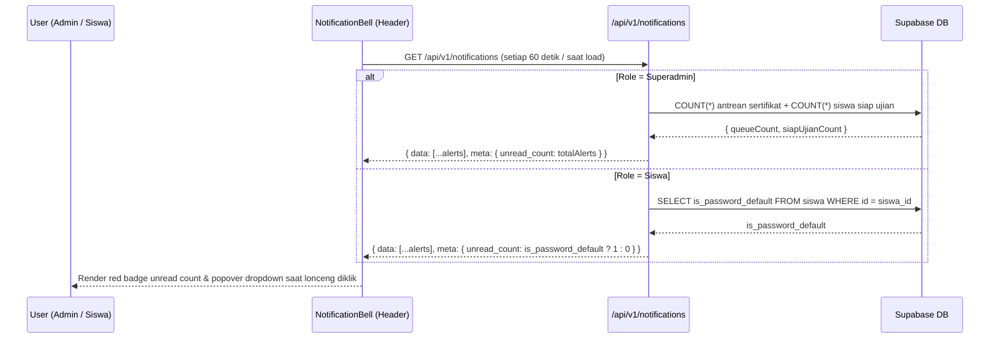

# Design: Arsitektur Sistem — LPKS Pengelasan Sumbu Hidup

---

## Dokumen 1: HLD (High-Level Design)

### Pola Arsitektur
**Monolitik Fullstack (Next.js App Router)**

Dipilih karena: satu developer, ~50 user, modal Rp 0, dan semua modul berbagi domain data yang sama (siswa, nilai, pembayaran). Tidak ada justifikasi memisah service. Arsitektur ini mudah di-deploy ke Vercel (gratis), mudah di-debug, dan mudah di-scale belakangan jika diperlukan (extract AI layer ke Edge Function terpisah).

---

### Diagram Komponen



---

### Tech Stack

| Layer | Teknologi | Alasan |
|---|---|---|
| **Frontend** | Next.js 15 (App Router, React 19) | Fullstack dalam satu repo, SSR/SSG, deploy gratis Vercel |
| **Backend/API** | Next.js API Routes | Satu codebase, tidak butuh server terpisah |
| **Database** | Supabase PostgreSQL | Free-tier generous (500MB), Row Level Security per-role |
| **Auth** | Supabase Auth | JWT bawaan, gratis, support custom roles (superadmin/siswa) |
| **ORM / Query** | Supabase JS Client (`@supabase/supabase-js`) | Native SDK, type-safe dengan `generate-types` |
| **AI (RAG + Summary)** | Gemini Flash API & Claude Sonnet API | Dual-model. Gemini untuk structured-data query cepat, Claude untuk penalaran SOP Las yang kompleks. |
| **Excel I/O** | SheetJS (`xlsx`) | Library client/server, parse & generate `.xlsx` tanpa dependensi berat |
| **PDF Sertifikat** | jsPDF + jsPDF-AutoTable | Generate PDF di sisi client, gratis, tanpa server tambahan |
| **GPS Geofencing** | Browser Native Geolocation API | Tidak butuh vendor pihak ketiga, nol biaya |
| **Charting (Grafik Nilai)** | Recharts | Lightweight, React-native, support line chart per kriteria |
| **Hosting** | Vercel (Free Hobby Tier) | Deploy otomatis dari Git, Edge Runtime, domain gratis |
| **Cron AI Summary** | Supabase Edge Functions (Deno) | Cron scheduler bawaan Supabase, gratis |

---

### Strategi Skalabilitas

Desain sederhana dulu, *scale-ready* belakangan:
- Database Supabase sudah managed PostgreSQL — koneksi pooling tersedia otomatis.
- Caching **belum diterapkan** di fase awal (50 user tidak memerlukan Redis layer). Jika load naik, tambah `unstable_cache` Next.js atau Supabase read replicas.
- AI query menggunakan **structured-data-to-context injection** (query SQL → format JSON/teks → inject ke prompt Gemini). Tidak butuh vector DB / embedding di skala ini.
- `ponytail:` caching skipped — 50 user aktif tidak perlu Redis. Tambah `unstable_cache` + connection pooler (PgBouncer, sudah ada di Supabase) jika MAU melebihi.

---

### Strategi Error Handling & Logging

- **Global Error Handler:** Next.js `error.tsx` per segment untuk FE; API Route wrapper `try/catch` standar yang selalu return `{ error: string, status: number }` terstruktur.
- **Validasi Input:** Zod di sisi API Route sebelum menyentuh database. Validasi geolocation (koordinat & radius) juga di backend, bukan hanya di FE, untuk mencegah manipulasi.
- **AI Fallback:** Jika Gemini API gagal/timeout → return pesan fallback "Asisten tidak tersedia saat ini, coba lagi." — tidak boleh crash halaman.
- **Logging:** `console.error` ke Vercel Log Drain (tersedia di free tier). Tidak pakai Sentry/Datadog dulu — `ponytail:` structured logging via Vercel cukup untuk 50 user; upgrade ke Sentry jika error rate naik.

---

### Environment & Branching

| Environment | Platform | Trigger |
|---|---|---|
| `development` | Localhost (`next dev`) | Kerja harian developer |
| `production` | Vercel | Push ke branch `main` |

- **Branching:** Trunk-based. Commit langsung ke `main` untuk fix kecil. Gunakan `feature/nama-fitur` branch pendek (max 2-3 hari) untuk fitur besar, lalu merge ke `main`.
- **Env Vars:** `.env.local` untuk dev, Vercel Environment Variables untuk prod. Secret tidak pernah di-commit ke repo.

---

## Dokumen 2: LLD (Low-Level Design)

### Struktur Folder Proyek

```
lpks-system/
├── src/
│   ├── app/                        # Next.js App Router
│   │   ├── (auth)/                 # Route group: login/logout pages
│   │   ├── (superadmin)/           # Route group: halaman superadmin
│   │   │   ├── layout.tsx          # Sidebar nav + header (notifications bell)
│   │   │   └── superadmin/
│   │   │       ├── dashboard/
│   │   │       ├── pendaftaran/
│   │   │       ├── siswa/          # Data Siswa (direktori)
│   │   │       ├── presensi/
│   │   │       ├── keuangan/
│   │   │       ├── penilaian/
│   │   │       ├── ujian/          # Ujian + antrean cetak sertifikat batch
│   │   │       ├── master/         # Master Data Dinamis (CRUD konfigurasi)
│   │   │       └── ai/             # AI Showcase (RAG + Summary)
│   │   ├── (siswa)/                # Route group: portal siswa
│   │   │   ├── layout.tsx          # Bottom nav bar + header (notifikasi)
│   │   │   └── siswa/
│   │   │       ├── beranda/        # Dashboard ringkasan pribadi
│   │   │       ├── presensi/       # Self check-in GPS geofencing
│   │   │       ├── nilai/          # Penilaian harian (siswa view)
│   │   │       ├── keuangan/       # Status keuangan siswa
│   │   │       ├── transkrip/      # Transkrip nilai + grafik tren
│   │   │       └── akun/           # Ganti password mandiri
│   │   └── api/v1/                 # API Routes (semua diawali /api/v1/)
│   │       ├── auth/
│   │       │   ├── login/
│   │       │   ├── logout/
│   │       │   ├── me/
│   │       │   └── change-password/
│   │       ├── siswa/
│   │       │   ├── next-id/
│   │       │   └── [id]/credentials/
│   │       ├── presensi/
│   │       │   └── today/
│   │       ├── keuangan/
│   │       │   └── rekap/[siswa_id]/
│   │       ├── penilaian/
│   │       ├── ujian/
│   │       ├── sertifikat/
│   │       │   ├── queue/          # Antrean cetak sertifikat fisik batch
│   │       │   └── [siswa_id]/
│   │       ├── master/
│   │       ├── notifications/      # Notifikasi sistem (bell icon)
│   │       ├── ai/
│   │       │   ├── query/          # RAG endpoint
│   │       │   └── summary/[siswa_id]/
│   │       ├── excel/
│   │       │   ├── template/
│   │       │   ├── import/
│   │       │   └── export/
│   │       └── health/             # Health check endpoint
│   ├── components/                 # Shared UI components
│   ├── lib/
│   │   ├── supabase/               # Supabase client (server, browser, admin)
│   │   ├── api-response.ts         # Shared response helpers + RBAC guards
│   │   ├── gate-checks.ts          # Business logic gates (sertifikat eligibility, dll)
│   │   ├── date-utils.ts           # Format tanggal Indo, Roman month, dll
│   │   ├── nilai-utils.ts          # Kriteria pass map builder
│   │   └── gemini.ts               # Gemini AI client
│   └── types/
│       └── database.ts             # TypeScript types (dari `supabase gen types`)
└── tests/
    ├── unit/                       # Jest unit tests (gates, validasi, geofencing, dll)
    └── integration/                # Integration tests (auth-rbac, presensi flow)
```

---

### Modul-Modul Utama

#### M01 — Auth & Role Guard
- **Tanggung Jawab:** Login/logout Superadmin & Siswa. Normalisasi identifier login: email superadmin dipakai langsung, username siswa dinormalisasi ke `username@lpks.id`. Enforce route protection berdasarkan role via Supabase Auth JWT + Middleware Next.js. Ganti password mandiri via `/api/v1/auth/change-password` (siswa), reset via `/api/v1/siswa/[id]/credentials` (superadmin).
- **Kontrak:** `POST /api/v1/auth/login` `{ identifier, password }` → `{ user: { role, is_password_default, ... } }`. Middleware cek role di setiap request ke `(superadmin)/*` dan `(siswa)/*`.
- **Dependensi:** Supabase Auth, Next.js Middleware.

#### M02 — Modul Pendaftaran
- **Tanggung Jawab:** Verifikasi checklist berkas fisik (form boolean, default 5–6 syarat dari Master Berkas), input biodata siswa lengkap, auto-generate Nomor Induk. Email bersifat opsional (auto-fallback `username@lpks.id` jika kosong).
- **Kontrak:** `POST /api/v1/siswa` → `{ siswa_id, nomor_induk }`. Nomor Induk digenerate di server: cari `no_urut` berikutnya yang tersedia via `GET /api/v1/siswa/next-id`, format `kode_program.XXXX`. Nomor urut dari siswa yang dihapus dapat digunakan kembali.
- **Dependensi:** M08 (Master Program untuk kode program), Supabase DB.

#### M03 — Modul Manajemen Data Siswa
- **Tanggung Jawab:** CRUD biodata siswa, filter status Aktif/Alumni (via `tanggal_keluar`), Import/Export/Template Excel. Soft-delete dengan anonimisasi sesuai UU PDP.
- **Kontrak:** `GET|PUT|DELETE /api/v1/siswa/[id]`, `GET /api/v1/siswa?status=aktif`, Excel I/O via `/api/v1/excel/*`.
- **Dependensi:** Supabase DB, SheetJS (lib/excel).

#### M04 — Modul Presensi GPS Geofencing
- **Tanggung Jawab:** Terima koordinat GPS siswa, hitung jarak ke koordinat LPKS (Haversine formula), tolak jika > radius, catat presensi harian (1x/hari per siswa). Rate limit: max 3 percobaan/siswa/hari.
- **Kontrak:** `POST /api/v1/presensi` `{ lat, lng }` → `{ status, jarak_meter }`. `GET /api/v1/presensi/today` untuk status hari ini. Superadmin: `GET|PUT /api/v1/presensi[/id]` (rekap & override manual).
- **Dependensi:** M08 (Master Lokasi & Radius), Supabase DB.

#### M05 — Modul Catatan Keuangan
- **Tanggung Jawab:** CRUD transaksi pembayaran per siswa, kalkulasi sisa tagihan, status lunas/cicil. Export bulanan format buku kas.
- **Kontrak:** `GET /api/v1/keuangan/rekap/[siswa_id]` → `{ tagihan_total, terbayar, sisa, status }`. `POST /api/v1/keuangan` untuk tambah transaksi. `GET /api/v1/excel/export?modul=keuangan` untuk export buku kas.
- **Dependensi:** M03 (data siswa), M08 (harga program dari Master).

#### M06 — Modul Penilaian Harian
- **Tanggung Jawab:** CRUD nilai harian per siswa per kriteria (skala 0-100). Tentukan kelayakan ujian (semua 5 kriteria ≥ 80 pernah dicapai). Grafik tren Recharts per kriteria. Export Excel rekapan nilai.
- **Kontrak:** `POST /api/v1/penilaian` `{ siswa_id, tanggal, penilaian }`. `GET /api/v1/penilaian?siswa_id=` → riwayat nilai + status kelayakan.
- **Dependensi:** M08 (Master Kriteria), Supabase DB.

#### M07 — Modul Ujian Internal & Sertifikasi
- **Tanggung Jawab:** Input nilai ujian 5 kriteria praktek + teori. Gate-check lunas (M05) + lulus ujian sebelum generate PDF sertifikat. Antrean cetak sertifikat fisik batch untuk percetakan.
- **Kontrak:** `POST /api/v1/ujian` (input nilai). `GET /api/v1/sertifikat/[siswa_id]` → PDF blob. `POST /api/v1/sertifikat/queue` → batch antrean cetak.
- **Dependensi:** M05 (status lunas), Supabase DB, jsPDF, date-utils.

#### M08 — Modul Master Data Dinamis
- **Tanggung Jawab:** CRUD tabel-tabel master (program pelatihan, kriteria penilaian, syarat berkas, titik lokasi & radius GPS). Semua modul lain membaca konfigurasi dari master ini.
- **Kontrak:** `GET|POST|PUT|DELETE /api/v1/master/program|kriteria|syarat-berkas|lokasi`.
- **Dependensi:** Supabase DB.

#### M09 — Modul AI Showcase
- **Tanggung Jawab (RAG Query):** Terima query natural language dari Superadmin, translate ke SQL query, inject hasil ke prompt Gemini, return jawaban naratif.
- **Tanggung Jawab (Weekly Summary):** Edge Function terjadwal tiap Senin 07.00 WIB. Generate ringkasan progres per siswa, simpan ke `ai_ringkasan_mingguan`.
- **Kontrak:** `POST /api/v1/ai/query` `{ pertanyaan }` → `{ jawaban }`. `GET /api/v1/ai/summary/[siswa_id]` → ringkasan per siswa.
- **Dependensi:** Gemini Flash API (lib/gemini), Supabase DB, M06, M05.
- `ponytail:` RAG menggunakan structured-data injection (SQL result → JSON → prompt), bukan vector embedding. Upgrade ke pgvector jika pertanyaan free-form menjadi terlalu kompleks untuk template query.

#### M10 — Modul Notifikasi Sistem
- **Tanggung Jawab:** Menampilkan notifikasi operasional di header bell icon. Siswa: alert ganti password default. Superadmin: alert operasional sistem. Badge unread count auto-refresh.
- **Kontrak:** `GET /api/v1/notifications` → `{ data: [...notif], meta: { unread_count } }`.
- **Dependensi:** Supabase DB, M01 (status `is_password_default`).

---

## Dokumen 3: Sequence Diagram

### Alur 1 — Login & Role Routing (dengan Normalisasi Identifier)



---

### Alur 2 — Pendaftaran Siswa Baru



---

### Alur 3 — Presensi Mandiri Siswa via GPS Geofencing



---

### Alur 4 — RAG Query AI (Asisten Analitik)



---

### Alur 5 — Gate Check, Antrean Cetak & Export Percetakan



---

### Alur 6 — Ganti Password Mandiri & Dismiss Banner



---

### Alur 7 — Notifikasi Operasional Header (Auto-Refresh)


