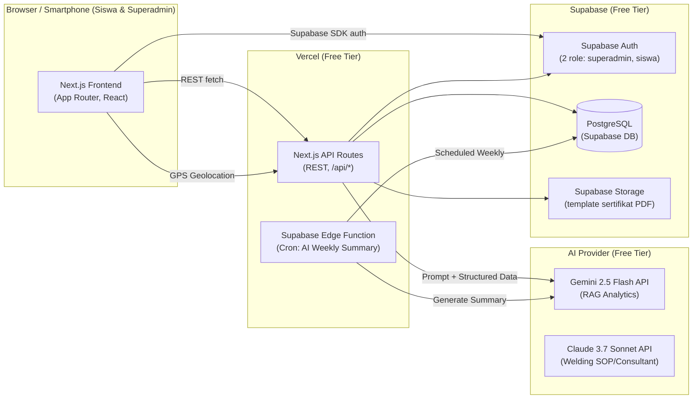
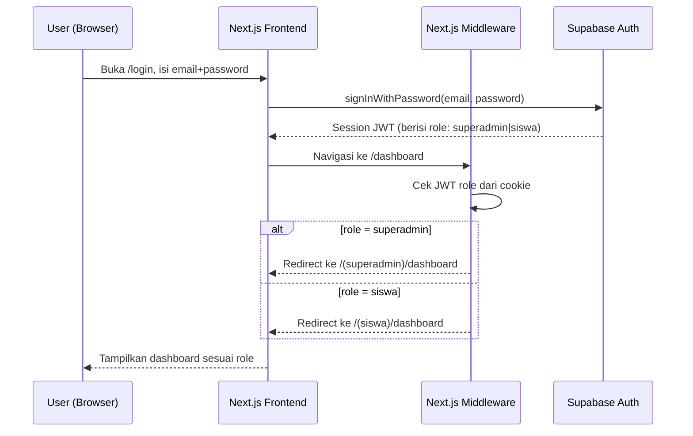
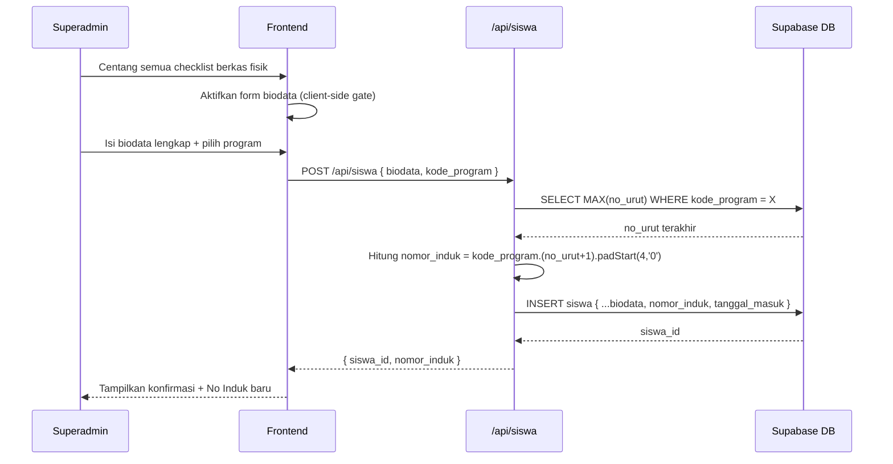
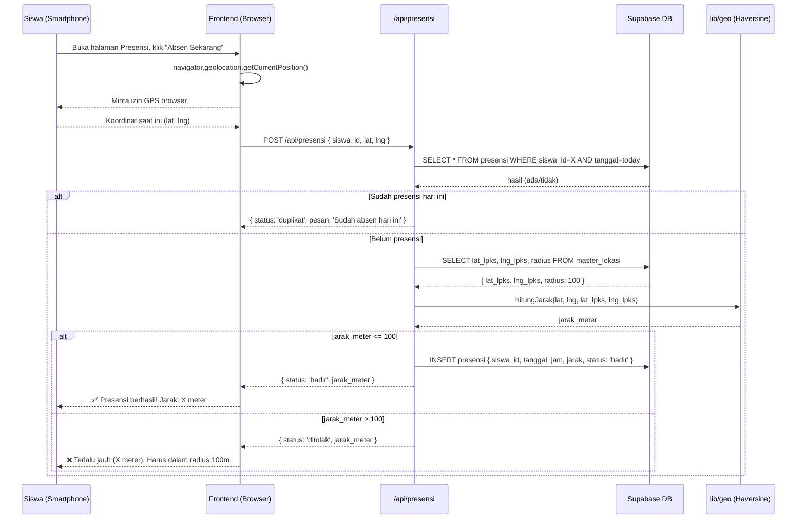
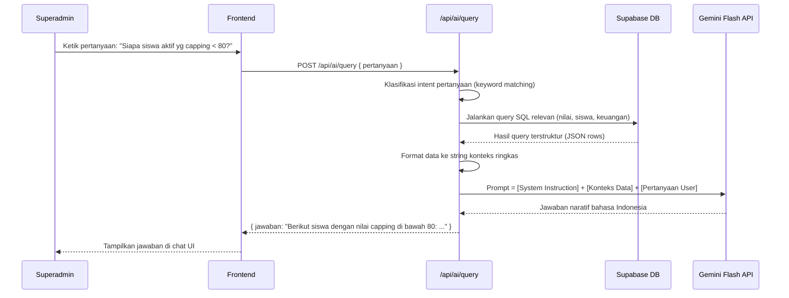
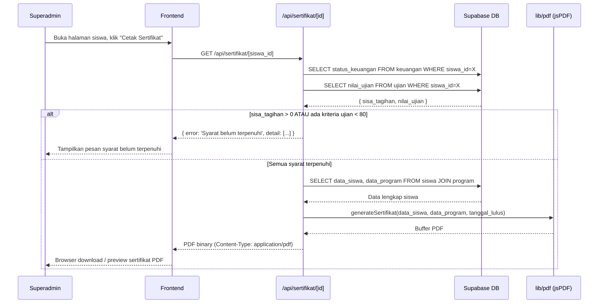

# Design: Arsitektur Sistem — LPKS Pengelasan Sumbu Hidup

---

## Dokumen 1: HLD (High-Level Design)

### Pola Arsitektur
**Monolitik Fullstack (Next.js App Router)**

Dipilih karena: satu developer, ~50 user, modal Rp 0, dan semua modul berbagi domain data yang sama (siswa, nilai, pembayaran). Tidak ada justifikasi memisah service. Arsitektur ini mudah di-deploy ke Vercel (gratis), mudah di-debug, dan mudah di-scale belakangan jika diperlukan (extract AI layer ke Edge Function terpisah).

---

### Diagram Komponen



---

### Tech Stack

| Layer | Teknologi | Alasan |
|---|---|---|
| **Frontend** | Next.js 15 (App Router, React 19) | Fullstack dalam satu repo, SSR/SSG, deploy gratis Vercel |
| **Backend/API** | Next.js API Routes | Satu codebase, tidak butuh server terpisah |
| **Database** | Supabase PostgreSQL | Free-tier generous (500MB), Row Level Security per-role |
| **Auth** | Supabase Auth | JWT bawaan, gratis, support custom roles (superadmin/siswa) |
| **ORM / Query** | Supabase JS Client (`@supabase/supabase-js`) | Native SDK, type-safe dengan `generate-types` |
| **AI (RAG + Summary)** | Gemini Flash API & Claude Sonnet API | Dual-model. Gemini untuk structured-data query cepat, Claude untuk penalaran SOP Las yang kompleks. |
| **Excel I/O** | SheetJS (`xlsx`) | Library client/server, parse & generate `.xlsx` tanpa dependensi berat |
| **PDF Sertifikat** | jsPDF + jsPDF-AutoTable | Generate PDF di sisi client, gratis, tanpa server tambahan |
| **GPS Geofencing** | Browser Native Geolocation API | Tidak butuh vendor pihak ketiga, nol biaya |
| **Charting (Grafik Nilai)** | Recharts | Lightweight, React-native, support line chart per kriteria |
| **Hosting** | Vercel (Free Hobby Tier) | Deploy otomatis dari Git, Edge Runtime, domain gratis |
| **Cron AI Summary** | Supabase Edge Functions (Deno) | Cron scheduler bawaan Supabase, gratis |

---

### Strategi Skalabilitas

Desain sederhana dulu, *scale-ready* belakangan:
- Database Supabase sudah managed PostgreSQL — koneksi pooling tersedia otomatis.
- Caching **belum diterapkan** di fase awal (50 user tidak memerlukan Redis layer). Jika load naik, tambah `unstable_cache` Next.js atau Supabase read replicas.
- AI query menggunakan **structured-data-to-context injection** (query SQL → format JSON/teks → inject ke prompt Gemini). Tidak butuh vector DB / embedding di skala ini.
- `ponytail:` caching skipped — 50 user aktif tidak perlu Redis. Tambah `unstable_cache` + connection pooler (PgBouncer, sudah ada di Supabase) jika MAU melebihi.

---

### Strategi Error Handling & Logging

- **Global Error Handler:** Next.js `error.tsx` per segment untuk FE; API Route wrapper `try/catch` standar yang selalu return `{ error: string, status: number }` terstruktur.
- **Validasi Input:** Zod di sisi API Route sebelum menyentuh database. Validasi geolocation (koordinat & radius) juga di backend, bukan hanya di FE, untuk mencegah manipulasi.
- **AI Fallback:** Jika Gemini API gagal/timeout → return pesan fallback "Asisten tidak tersedia saat ini, coba lagi." — tidak boleh crash halaman.
- **Logging:** `console.error` ke Vercel Log Drain (tersedia di free tier). Tidak pakai Sentry/Datadog dulu — `ponytail:` structured logging via Vercel cukup untuk 50 user; upgrade ke Sentry jika error rate naik.

---

### Environment & Branching

| Environment | Platform | Trigger |
|---|---|---|
| `development` | Localhost (`next dev`) | Kerja harian developer |
| `production` | Vercel | Push ke branch `main` |

- **Branching:** Trunk-based. Commit langsung ke `main` untuk fix kecil. Gunakan `feature/nama-fitur` branch pendek (max 2-3 hari) untuk fitur besar, lalu merge ke `main`.
- **Env Vars:** `.env.local` untuk dev, Vercel Environment Variables untuk prod. Secret tidak pernah di-commit ke repo.

---

## Dokumen 2: LLD (Low-Level Design)

### Struktur Folder Proyek

```
lpks-system/
├── app/                        # Next.js App Router
│   ├── (auth)/                 # Route group: login/register
│   ├── (superadmin)/           # Route group: halaman superadmin
│   │   ├── dashboard/
│   │   ├── pendaftaran/
│   │   ├── siswa/              # Data Siswa (direktori)
│   │   ├── presensi/
│   │   ├── keuangan/
│   │   ├── penilaian/
│   │   ├── ujian/
│   │   ├── pengaturan/         # Master Data Dinamis
│   │   └── ai/                 # AI Showcase (RAG + Summary)
│   ├── (siswa)/                # Route group: portal siswa
│   │   ├── dashboard/
│   │   ├── presensi/           # Self check-in GPS
│   │   ├── nilai/
│   │   └── sertifikat/
│   └── api/                    # API Routes
│       ├── auth/
│       ├── siswa/
│       ├── presensi/
│       ├── keuangan/
│       ├── penilaian/
│       ├── ujian/
│       ├── sertifikat/
│       ├── master/
│       ├── ai/
│       │   ├── query/          # RAG endpoint
│       │   └── summary/        # Trigger manual summary
│       └── excel/
│           ├── template/       # Download template xlsx
│           ├── import/         # Import xlsx
│           └── export/         # Export xlsx
├── components/                 # Shared UI components
├── lib/
│   ├── supabase/               # Supabase client (server & browser)
│   ├── ai/                     # Gemini API wrapper & RAG logic
│   ├── excel/                  # SheetJS helpers (parse & generate)
│   ├── pdf/                    # jsPDF sertifikat generator
│   └── geo/                    # Geofencing calculation (Haversine)
├── types/                      # TypeScript types (dari `supabase gen types`)
└── supabase/
    ├── migrations/             # SQL migration files
    └── functions/              # Edge Functions (cron weekly summary)
```

---

### Modul-Modul Utama

#### M01 — Auth & Role Guard
- **Tanggung Jawab:** Login/logout Superadmin & Siswa. Enforce route protection berdasarkan role via Supabase Auth JWT + RLS.
- **Kontrak:** `POST /api/auth/login` → `{ session, role }`. Middleware Next.js cek role di setiap request `(superadmin)/*` dan `(siswa)/*`.
- **Dependensi:** Supabase Auth, Next.js Middleware.

#### M02 — Modul Pendaftaran
- **Tanggung Jawab:** Verifikasi checklist berkas fisik (form boolean), input biodata siswa lengkap, auto-generate Nomor Induk.
- **Kontrak:** `POST /api/siswa` → `{ siswa_id, nomor_induk }`. Nomor Induk digenerate di server: ambil `MAX(no_urut)` per `kode_program`, increment, format `kode_program.XXXX`.
- **Dependensi:** M07 (Master Program untuk kode program), Supabase DB.

#### M03 — Modul Manajemen Data Siswa
- **Tanggung Jawab:** CRUD biodata siswa, filter status Aktif/Alumni (via `tanggal_keluar`), Import/Export/Template Excel.
- **Kontrak:** `GET/PUT/DELETE /api/siswa/[id]`, `GET /api/siswa?status=aktif`, `POST /api/excel/import?modul=siswa`, `GET /api/excel/export?modul=siswa`, `GET /api/excel/template?modul=siswa`.
- **Dependensi:** Supabase DB, SheetJS (lib/excel).

#### M04 — Modul Presensi GPS Geofencing
- **Tanggung Jawab:** Terima koordinat GPS siswa, hitung jarak ke koordinat LPKS (Haversine formula di `lib/geo`), tolak jika > radius, catat presensi harian (1x/hari per siswa, cek duplikasi di DB).
- **Kontrak:** `POST /api/presensi` `{ siswa_id, lat, lng }` → `{ status: 'hadir'|'ditolak', jarak_meter }`. Superadmin: `GET /api/presensi?tanggal=&siswa_id=`, `PUT /api/presensi/[id]` (override).
- **Dependensi:** M07 (Master Lokasi & Radius), Supabase DB.

#### M05 — Modul Catatan Keuangan
- **Tanggung Jawab:** CRUD transaksi pembayaran per siswa, kalkulasi sisa tagihan, status lunas/cicil.
- **Kontrak:** `GET /api/keuangan?siswa_id=` → `{ tagihan_total, terbayar, sisa, status }`. `POST /api/keuangan` untuk tambah transaksi.
- **Dependensi:** M03 (data siswa), M07 (harga program dari Master).

#### M06 — Modul Penilaian Harian
- **Tanggung Jawab:** CRUD nilai harian per siswa per kriteria (skala 0-100). Tentukan kelayakan ujian (semua 5 kriteria ≥ 80 pernah dicapai — bukan rata-rata, tapi status "pernah ≥ 80" per kriteria).
- **Kontrak:** `POST /api/penilaian` `{ siswa_id, tanggal, kriteria, nilai }`. `GET /api/penilaian?siswa_id=` → array riwayat nilai untuk grafik Recharts.
- **Dependensi:** M07 (Master Kriteria), Supabase DB.

#### M07 — Modul Ujian Internal & Sertifikasi
- **Tanggung Jawab:** Input nilai ujian tertulis & 5 kriteria praktek. Gate-check lunas (M05) + lulus ujian (semua kriteria ≥ 80) sebelum generate PDF sertifikat.
- **Kontrak:** `POST /api/ujian` `{ siswa_id, tertulis, root, hotpass, filler, capping, gerinda }`. `GET /api/sertifikat/[siswa_id]` → PDF blob (jsPDF di server-side route).
- **Dependensi:** M05 (status lunas), Supabase DB, jsPDF (lib/pdf).

#### M08 — Modul Master Data Dinamis
- **Tanggung Jawab:** CRUD tabel-tabel master (program pelatihan, kriteria penilaian, syarat berkas, titik lokasi & radius GPS).
- **Kontrak:** `GET|POST|PUT|DELETE /api/master/program`, `/api/master/kriteria`, `/api/master/syarat`, `/api/master/lokasi`.
- **Dependensi:** Supabase DB.

#### M09 — Modul AI Showcase
- **Tanggung Jawab (RAG Query):** Terima query natural language dari Superadmin, translate ke SQL query (atau pilih query template pre-built), eksekusi ke DB, inject hasil ke prompt Gemini, return jawaban naratif.
- **Tanggung Jawab (Weekly Summary):** Edge Function dijadwalkan tiap Senin 07.00 WIB. Ambil data progres semua siswa aktif, generate ringkasan per siswa, simpan ke tabel `ai_ringkasan_mingguan`.
- **Kontrak:** `POST /api/ai/query` `{ pertanyaan }` → `{ jawaban: string }`. Edge Function: internal, tidak ada REST endpoint publik.
- **Dependensi:** Gemini Flash API (lib/ai), Supabase DB, M06, M05.
- `ponytail:` RAG menggunakan structured-data injection (SQL result → JSON → prompt), bukan vector embedding. Upgrade ke pgvector jika pertanyaan free-form menjadi terlalu kompleks untuk template query.

---

## Dokumen 3: Sequence Diagram

### Alur 1 — Login & Role Routing



---

### Alur 2 — Pendaftaran Siswa Baru



---

### Alur 3 — Presensi Mandiri Siswa via GPS



---

### Alur 4 — RAG Query AI (Asisten Analitik)



---

### Alur 5 — Gate Check & Cetak Sertifikat


